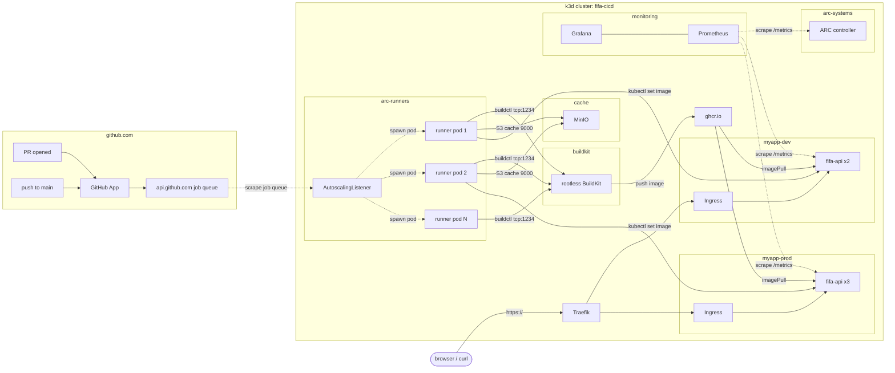

# KubernetesDeploymentFifaAPI

Self-hosted CI/CD platform on Kubernetes for the [FIFA Player Stats GraphQL API](https://github.com/ajugulum123/Fifa_API). Demonstrates a production-grade approach to CI/CD infrastructure: ephemeral runner pods spun up on demand, rootless container builds, RBAC-scoped deploys, queue-depth autoscaling, a shared cache layer and a Prometheus plus Grafana observability stack.

## What this repo contains

This is the **platform repo**. The application source lives in [`ajugulum123/Fifa_API`](https://github.com/ajugulum123/Fifa_API). This repo is responsible for:

- The Kubernetes cluster definition and bootstrap (k3d locally, portable to EKS / GKE / AKS later)
- Actions Runner Controller (ARC) installation and `AutoscalingRunnerSet` configuration
- The custom runner image with kubectl, helm, buildctl, docker CLI, Node 20
- The rootless BuildKit Deployment used by all workflows to build images
- The shared MinIO + S3-compatible Actions cache
- All Kubernetes manifests (Deployment, Service, Ingress, ConfigMap, NetworkPolicy, RBAC) for the API across `myapp-dev` and `myapp-prod`
- The CD entry point manifests (the workflow itself lives in the app repo)
- The observability stack (kube-prometheus-stack, ServiceMonitors, Grafana dashboard, alert rules)
- Default-deny + allow-list NetworkPolicies, ResourceQuota and PodSecurityAdmission

## Architecture



## End-to-end flow

A push to `main` on the app repo triggers:

1. **Listener** sees a queued job, spawns a runner pod in `arc-runners`.
2. **Test job** runs typecheck, vitest, gitleaks. No Kubernetes API calls.
3. **Build job** asks BuildKit (over `tcp://buildkitd.buildkit.svc:1234`) to build the multi-stage Dockerfile, push to GHCR with the SHA tag and a registry-mode cache ref. Trivy scans the resulting image and fails the run on critical CVEs.
4. **Deploy-dev job** uses the runner pod's mounted ServiceAccount token (the `app-deployer` SA in `arc-runners`) to `kubectl apply -k` and `kubectl set image deployment/fifa-api ...:$SHA -n myapp-dev`, then waits on `kubectl rollout status`.
5. **Deploy-prod job** is gated by the `production` GitHub Environment which requires a human approver. After approval the same flow applies to `myapp-prod`.

Throughout, Prometheus scrapes the ARC controller, the runner pods and the API itself. Grafana shows queue depth, runner pool size, request rate, latency p99 and 5xx rate side by side.

## Layout

```
KubernetesDeploymentFifaAPI/
.. README.md                               (this file)
.. LICENSE
.. .gitignore
.. clusters/
   .. local-k3d/                           cluster bootstrap notes
.. docs/
   .. ARCHITECTURE.md                      design and phased plan
   .. GITHUB_ENVIRONMENTS.md                approval gate setup
   .. SECURITY.md                          posture today + follow-ups
   .. RUNBOOK.md                           day-2 ops procedures
   .. DEMO.md                              how to reproduce the demo end-to-end
.. helm-values/
   .. fifa-runners.yaml                    gha-runner-scale-set values
   .. kube-prometheus-stack.yaml           prometheus + grafana + alertmanager values
.. kubernetes/
   .. app/myapp-dev/                       Deployment, Service, Ingress, RBAC, NetworkPolicy, Kustomize
   .. app/myapp-prod/                      same shape, hardened, plus PDB
   .. buildkit/                            rootless BuildKit Deployment, Service, RBAC, NetworkPolicy
   .. cache/                               MinIO Deployment, Service, bucket-init Job, NetworkPolicy
   .. observability/                       ServiceMonitors, PrometheusRule alerts, Grafana dashboard CM
   .. policies/                            arc-runners NetworkPolicy, ResourceQuota, LimitRange
   .. rbac/                                cluster-scope RBAC (preview-deployer)
.. runner-image/
   .. Dockerfile                           extends ghcr.io/actions/actions-runner
   .. README.md
.. .github/
   .. workflows/                           smoke-test.yml, build-runner-image.yml
```

## Quick start

If you have an existing k3d cluster `fifa-cicd` and the GitHub App configured:

```bash
# 1. ARC controller (already done if you followed the install guide)
helm upgrade --install arc \
  --namespace arc-systems --create-namespace \
  oci://ghcr.io/actions/actions-runner-controller-charts/gha-runner-scale-set-controller

# 2. Runner scale set
helm upgrade --install fifa-runners \
  --namespace arc-runners --create-namespace \
  --values helm-values/fifa-runners.yaml \
  oci://ghcr.io/actions/actions-runner-controller-charts/gha-runner-scale-set

# 3. RBAC (deployer SA + cluster role for previews)
kubectl apply -f kubernetes/rbac/

# 4. BuildKit
kubectl apply -k kubernetes/buildkit

# 5. Cache
kubectl apply -k kubernetes/cache  # after creating the credentials Secret first

# 6. App namespaces and policies
kubectl apply -k kubernetes/policies
kubectl apply -k kubernetes/app/myapp-dev
kubectl apply -k kubernetes/app/myapp-prod

# 7. Observability
helm upgrade --install monitoring prometheus-community/kube-prometheus-stack \
  -n monitoring --create-namespace \
  --values helm-values/kube-prometheus-stack.yaml
kubectl apply -k kubernetes/observability
```

After that, push a commit to `Fifa_API/main` and watch the loop happen end-to-end.

## What I would do next

Things that are deliberately out of scope for v1 but are the obvious next steps:

1. **GitOps with Argo CD or Flux.** Today the CD workflow does `kubectl apply` from inside the runner. A pull-based system (Argo CD watching this platform repo) decouples the app pipeline from cluster credentials and gives you free drift detection.
2. **Cilium for FQDN egress.** Replace the `0.0.0.0/0:443` allow-rule on `arc-runners` with `ToFQDNs: [api.github.com, ghcr.io, registry.npmjs.org, ...]` so a compromised runner cannot exfiltrate to arbitrary endpoints.
3. **OIDC federation to AWS or GCP.** Wire the runner SA's projected token to a cloud IAM role so the platform never holds a static cloud credential.
4. **Sigstore image signing.** `cosign sign` after every push, `cosign verify` admission policy on every pull. The image supply chain is the next ground to defend.
5. **External Secrets Operator.** Move JWT secrets, admin password and registry creds into a real backing store (Vault, AWS Secrets Manager, Doppler).
6. **HA control plane and multi-cluster.** Today is a single k3d cluster. The manifests, Helm values and workflow YAML are intentionally portable. Standing up a second cluster (a different region, or a different cloud) and pointing the same workflows at both would require: a cluster registry pattern (Argo CD ApplicationSet), cross-cluster image promotion and a shared (or replicated) registry cache.
7. **Loki + Tempo.** kube-prometheus-stack covers metrics. Logs (Loki) and traces (Tempo) round out observability into a single Grafana pane of glass.
8. **Runner image hardening.** The current image is Ubuntu-based for tooling availability. A distroless or Wolfi-based runner image would shave the attack surface significantly.
9. **Self-hosted GHCR alternative.** GHCR is the registry today because it is free and it integrates with the App. Stretch goal: stand up Harbor in-cluster as a second registry and switch authoritatively.
10. **Real domain plus Let's Encrypt.** Today everything terminates on `*.dev.local` with self-signed certs. Pointing a real domain at the cluster, plus cert-manager's Let's Encrypt issuer, would close the loop on the prod story.

## Quick links

| | |
|---|---|
| Application repo | https://github.com/ajugulum123/Fifa_API |
| Architecture doc | [docs/ARCHITECTURE.md](docs/ARCHITECTURE.md) |
| Demo walkthrough | [docs/DEMO.md](docs/DEMO.md) |
| Day-2 runbook | [docs/RUNBOOK.md](docs/RUNBOOK.md) |
| Security posture | [docs/SECURITY.md](docs/SECURITY.md) |
| GitHub Environments setup | [docs/GITHUB_ENVIRONMENTS.md](docs/GITHUB_ENVIRONMENTS.md) |
| License | MIT. See [LICENSE](LICENSE) |
